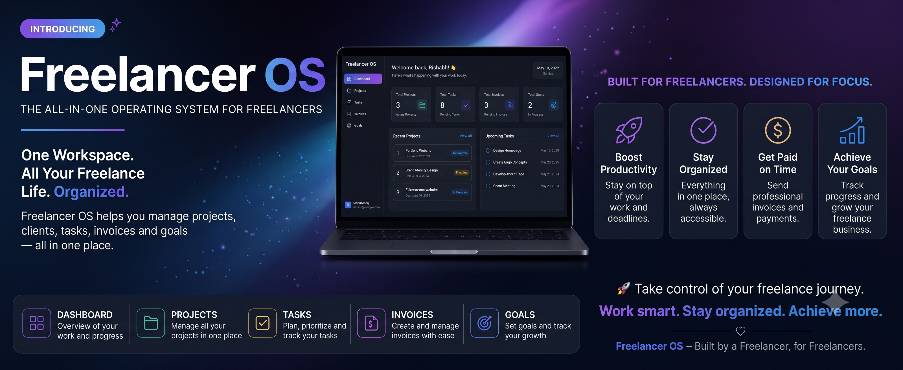

<div align="center">

# 🧾 Freelance Business OS

### Your entire freelance business, unified in one dashboard.

**Stop juggling Excel, WhatsApp, Notes, and Drive. Start running your business like a business.**

<br/>


<br/>



<sub>Operations Center dashboard — revenue, receivables, active projects, and AI-driven insights at a glance.</sub>

</div>

<br/>

## 📚 Table of Contents

- [The Problem](#-the-problem)
- [The Solution](#-the-solution)
- [Tech Stack](#️-tech-stack)
- [Features](#-features)
- [Screenshots](#-screenshots)
- [Prerequisites](#-prerequisites)
- [Quick Start](#-quick-start)
- [Key Libraries & Dependencies](#-key-libraries--dependencies)
- [Project Structure](#-project-structure)
- [Roadmap](#️-roadmap)
- [Contributing](#-contributing)
- [License](#-license)
- [Support](#-support--contact)

---

## 😩 The Problem

Freelancers don't fail because of bad work — they fail because of **operational chaos**. A typical freelancer's "business system" looks like this:

| Task | Tool | Result |
|---|---|---|
| Tracking clients | 📝 Apple Notes / random Google Doc | Forgotten follow-ups |
| Sending quotes | 📄 Word doc emailed manually | Inconsistent, unprofessional |
| Invoicing | 📊 Excel + copy-pasted templates | Errors, delays |
| Payment tracking | 💬 WhatsApp "did you pay?" messages | Missed/late payments |
| Contracts | ☁️ Buried in Google Drive folders | Lost context, no audit trail |
| Client comms | ✍️ Written from scratch every time | Wasted hours, weak pitches |

The result: **lost context, fragmented records, and missed payments** — the three silent killers of freelance income.

## ✅ The Solution

**Freelance Business OS** replaces that patchwork with a single, purpose-built dashboard that handles your business end-to-end — from first contact to final payment.

<div align="center">

| 🧩 Before: Scattered Chaos | 🚀 After: Freelance Business OS |
|:---|:---|
| Client info spread across Notes, WhatsApp, email | Centralized CRM with full interaction history |
| Quotes built manually in Word/Docs | Branded proposals generated in minutes |
| Invoices tracked in spreadsheets | One-click invoicing, auto-numbered & synced |
| Manually chasing unpaid invoices | Real-time payment status + automated reminders |
| Contracts lost in Drive folders | Encrypted, searchable document vault |
| Writing pitches/emails from scratch | AI drafts client-ready copy in seconds |
| 5+ disconnected tools | 1 unified operating system |

</div>

---

## 🛠️ Tech Stack

<div align="center">


</div>

| Layer | Technology |
|---|---|
| **Frontend** | React (Vite/CRA), JavaScript (ES6+) |
| **Styling / UI** | Tailwind CSS |
| **Backend** | Node.js, Express.js (REST API) |
| **Database** | MongoDB + Mongoose ¹ |
| **Auth** | JWT-based authentication |
| **AI** | OpenAI API — powers the "Freelance Copilot" assistant ¹ |
| **PDF Generation** | jsPDF / Puppeteer (invoice & proposal export) ¹ |
| **Package Manager** | npm |

<sub>¹ Marked items reflect the project's current architecture as best inferred from the app UI — please confirm/update against your actual `package.json` and swap in the real values.</sub>

---

## ✨ Features

### 1. 👥 Client CRM & Contact Management
- Centralized client profiles with contact details, notes, and tags
- Track account status — Active, Lead, Inactive — with lifetime revenue per client
- Quick search and filtering across your entire client base
- Full interaction timeline linked to projects and invoices

### 2. 📄 Proposal & Quote Generation
- AI-crafted, branded proposals generated from a project brief
- Track proposal status — Draft, Sent, Accepted
- Line-item pricing with total investment summary
- Convert an accepted proposal into a project or invoice in one click

### 3. 💳 One-Click Invoicing & Billing
- Auto-numbered, professional invoices (e.g. `INV-2026-002`)
- Live status tracking — Draft, Sent, Paid, Overdue
- Multi-currency support
- Downloadable PDF + shareable payment link

### 4. ⏱️ Real-time Payment Tracking & Overdue Reminders
- Live dashboard of total collected vs. pending/overdue receivables
- Automated reminders for invoices past due
- Cash flow & revenue history charts (trailing 6 months)
- Client revenue-share breakdown for spotting concentration risk

### 5. 🔐 Contract Storage & Document Vault
- Encrypted document storage for contracts and signed agreements
- Documents linked directly to clients and projects
- Enterprise-grade security with JWT authentication
- Searchable, centralized vault — no more digging through Drive folders

### 6. 🤖 AI-Powered Email & Pitch Writing Assistant
- **Freelance Copilot** — an AI business partner with real-time context on your clients, projects, tasks, and invoices
- Suggested queries: *"Which clients owe me money?"*, *"Draft a client follow-up message"*, *"Why did my revenue decrease?"*
- Strategic health analysis with actionable recommendations (e.g. rate optimization, follow-up prioritization)
- Context-aware pitch and email drafting powered by OpenAI

**Bonus — included in the current build:**
- 📋 **Task Board** — Kanban-style sprint board (To Do / In Progress / Review / Done) with subtasks and AI prioritization
- 📁 **Projects & Roadmaps** — milestone tracking with hours-progress bars and budget-per-project

---

## 🖼️ Screenshots

<details open>
<summary><strong>Click to expand / collapse gallery</strong></summary>

| Landing Page | Dashboard |
|:---:|:---:|
|  |  |

| Clients CRM | Projects & Roadmaps |
|:---:|:---:|
|  |  |

| Task Board | Proposals & Bids |
|:---:|:---:|
|  |  |

| Invoices & Billing | Freelance Copilot (AI) |
|:---:|:---:|
|  |  |

</details>

---

## 📋 Prerequisites

Before you begin, ensure you have the following installed:

| Requirement | Version | Notes |
|---|---|---|
| **Node.js** | `v18+` (LTS recommended) | [Download](https://nodejs.org) |
| **npm** | `v9+` | Ships with Node.js |
| **MongoDB** | `v6+` | Local install or hosted (MongoDB Atlas) |
| **Git** | Latest | For cloning the repo |

You'll also need an API key for:

- 🔑 **OpenAI API Key** — [platform.openai.com](https://platform.openai.com/api-keys) (powers the Freelance Copilot AI assistant)

---

## 🚀 Quick Start

### 1. Clone the repository

```bash
git clone https://github.com/SpideyScript/freelance-os.git
cd freelance-os
```

### 2. Install dependencies

```bash
npm install
```

> If the project is split into separate `client/` and `server/` folders, run `npm install` inside each:
> ```bash
> cd server && npm install
> cd ../client && npm install
> ```

### 3. Configure environment variables

Copy the example file and fill in your credentials:

```bash
cp .env.example .env
```

<details>
<summary><strong>📄 View <code>.env.example</code></strong></summary>

```env
# ── App ────────────────────────────────────────────────
NODE_ENV=development
PORT=5000
CLIENT_URL=http://localhost:3000

# ── Database ───────────────────────────────────────────
MONGO_URI=mongodb://localhost:27017/freelance-os

# ── Auth ───────────────────────────────────────────────
JWT_SECRET=your-random-jwt-secret
JWT_EXPIRES_IN=7d

# ── OpenAI (Freelance Copilot AI) ──────────────────────
OPENAI_API_KEY=sk-xxxxxxxxxxxxxxxxxxxxxxxx
OPENAI_MODEL=gpt-4o-mini

# ── Email / Notifications (optional) ───────────────────
EMAIL_PROVIDER=resend
RESEND_API_KEY=re_xxxxxxxxxxxxxxxxxxxxxxxx
EMAIL_FROM="Freelance Business OS <noreply@yourdomain.com>"
```

</details>

### 4. Run database migrations / seed data

```bash
npm run seed
```

### 5. Launch the development server

```bash
npm run dev
```

Your app will be running at **`http://localhost:3000`** (frontend) with the API on **`http://localhost:5000`** 🎉

### 6. Build for production

```bash
npm run build
npm start
```

---

## 📦 Key Libraries & Dependencies

| Library | Purpose |
|---|---|
| **`react`** / **`react-dom`** | Core UI library |
| **`react-router-dom`** | Client-side routing |
| **`express`** | Backend REST API framework |
| **`mongoose`** | MongoDB ODM / schema modeling |
| **`jsonwebtoken`** | JWT-based authentication |
| **`bcryptjs`** | Password hashing |
| **`openai`** | AI SDK powering the Freelance Copilot assistant |
| **`axios`** | HTTP client for frontend ↔ API communication |
| **`tailwindcss`** | Utility-first styling |
| **`recharts`** / **`chart.js`** | Revenue & cash flow analytics charts |
| **`react-hook-form`** | Form state management |
| **`jspdf`** / **`puppeteer`** | Invoice & proposal PDF generation |
| **`dotenv`** | Environment variable management |
| **`cors`** | Cross-origin request handling |

<sub>⚠️ Please cross-check this list against your actual `package.json` files and update as needed — it's provided as a representative baseline for a React + Express + MongoDB stack.</sub>

---

## 🗂️ Project Structure

<details>
<summary><strong>Click to expand folder structure</strong></summary>

```
freelance-os/
├── client/                    # React frontend
│   ├── public/
│   └── src/
│       ├── components/        # Reusable UI components
│       ├── pages/              # Dashboard, CRM, Invoices, Proposals, etc.
│       ├── context/             # Auth & global state
│       ├── hooks/                # Custom React hooks
│       ├── services/              # API call wrappers (axios)
│       └── App.jsx
├── server/                    # Express backend
│   ├── config/                 # DB connection, env config
│   ├── controllers/             # Route handlers (clients, invoices, proposals, AI)
│   ├── middleware/               # Auth guards, error handling
│   ├── models/                    # Mongoose schemas
│   ├── routes/                     # API route definitions
│   └── server.js
├── .env.example
├── package.json
└── README.md
```

</details>

---

## 🗺️ Roadmap

- [x] Client CRM & pipeline management
- [x] Proposal & quote generation (AI-crafted)
- [x] One-click invoicing & billing
- [x] Task board with Kanban workflow
- [x] Freelance Copilot AI assistant (v1)
- [ ] 📱 Mobile-responsive PWA
- [ ] 🔄 Recurring retainer billing automation
- [ ] 💳 Payment gateway integration (Stripe / Razorpay)
- [ ] 📊 Advanced analytics & tax reports
- [ ] 🔗 Zapier / Make.com integrations
- [ ] 🧠 AI-powered project scoping estimator

Have an idea? [Open a feature request →](https://github.com/SpideyScript/freelance-os/issues/new?labels=enhancement)

---

## 🤝 Contributing

Contributions are what make the open-source community amazing. Any contributions you make are **greatly appreciated**.

1. **Fork** the repository
2. **Create** your feature branch
```bash
   git checkout -b feature/amazing-feature
```
3. **Commit** your changes
```bash
   git commit -m "Add: amazing feature"
```
4. **Push** to your branch
```bash
   git push origin feature/amazing-feature
```
5. **Open a Pull Request** and describe your changes

Please read [`CONTRIBUTING.md`](./CONTRIBUTING.md) for the code style guide, commit conventions, and PR review process before submitting.

---

## 📄 License

Distributed under the **MIT License**. See [`LICENSE`](./LICENSE) for full details.

```
MIT License © 2026 Freelance Business OS Contributors
```

---

## 💬 Support & Contact

<div align="center">

Found a bug or have a feature request? [Open an issue](https://github.com/SpideyScript/freelance-os/issues)

Have questions? Reach out via [Discussions](https://github.com/SpideyScript/freelance-os/discussions)

⭐ **If this project helps you run your freelance business better, consider giving it a star!** ⭐

</div>